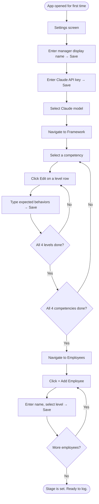
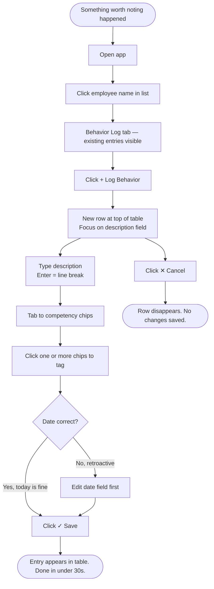
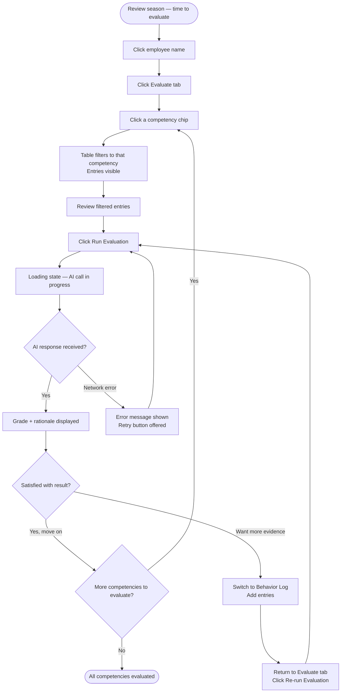
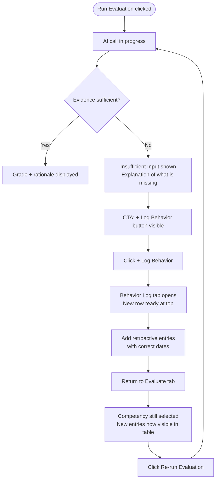

# UX Design Specification — Employee Competence Evaluation Tool

**Author:** Diego
**Date:** 2026-04-22

---

<!-- UX design content will be appended sequentially through collaborative workflow steps -->

## Executive Summary

### Project Vision

The Employee Competence Evaluation Tool shifts competency reviews from a painful annual memory exercise into a continuous, structured logging habit. Managers capture observable behaviors as they happen throughout the year; at review time, an AI engine compares that evidence against the configured expected behaviors for the employee's level and returns a structured grade with a written rationale. The PoC goal is to validate that this approach produces grades a manager can trust and stand behind.

### Target Users

**Primary (only) user: the people manager — "Marco"**

- Responsible for periodic competency evaluations across multiple employees at different levels (A/B/C/D)
- Comfortable with software, but not technical
- Works in two distinct modes: frequent low-stakes logging throughout the year, and infrequent high-stakes evaluation at review time
- Needs to log behaviors quickly when they occur — not in a drawn-out workflow
- Values being able to explain grades to employees with grounded evidence

No employee-facing interface. No admin role. Single-user, single-machine desktop application.

### Key Design Challenges

1. **Logging friction is the make-or-break risk.** If adding a behavior log entry takes too many clicks or too much thought, the manager won't build the habit. The logging flow must feel effortless and fast.
2. **Information architecture across two time modes.** "Logging mode" (ongoing, quick) and "evaluation mode" (infrequent, analytical) are very different mental states — the UI needs to support both without confusion.
3. **AI result trust-building.** The grade + rationale must feel *grounded*, not like a black-box verdict. How the evidence connection is displayed will determine whether the manager trusts or dismisses the output.
4. **One-time setup shouldn't feel overwhelming.** The competency framework configuration is a front-loaded investment — if the first session feels like homework, the tool loses before it begins.

### Design Opportunities

1. **A logging experience so fast it becomes a reflex** — minimal fields, smart defaults, one-tap competency tagging.
2. **The evaluation view as a narrative reveal** — showing the grade alongside the actual log entries that informed it, making the rationale feel earned.

## Core User Experience

### Defining Experience

The heartbeat of this product is **behavior logging**. It happens far more often than any other action — throughout the year, whenever something worth noting occurs. If it takes 30 seconds, Marco might do it. If it takes 2 minutes, he won't. The entire PoC hypothesis collapses if logging doesn't become a habit, so the log entry flow must be the fastest, most frictionless interaction in the app.

The evaluation view is the complementary payoff — infrequent, high-stakes, analytical. Here the manager is in a different mental state: reviewing, comparing, judging. The AI grade and rationale must feel like a trusted colleague summarizing evidence, not a machine issuing a verdict.

### Platform Strategy

- **Platform:** Desktop application (Electron), Windows as primary target
- **Input:** Mouse + keyboard — no touch requirements
- **Connectivity:** Offline for all features except AI evaluation calls, which require internet access to the Claude API
- **Deployment:** Single user, single machine — no authentication, no multi-tenancy
- **Distribution:** Manual installer (`.exe`) shared directly with testing managers

### Effortless Interactions

- **Opening the app and getting straight to logging** — no loading screens or dashboards to navigate past; the path to a new log entry is always one action away
- **Competency tagging** — single click per competency, not a dropdown or multi-step selector; multiple tags selected in one gesture
- **Date entry** — today pre-filled; easy to adjust for retroactive entries without friction
- **Triggering an AI assessment** — one button, clear loading state, no configuration required at that moment
- **Employee selection** — quick to pick from the list, not buried in navigation

### Critical Success Moments

1. **First session — setup** — Marco configures the framework and registers his employees without feeling overwhelmed. He closes the app feeling *ready*, not exhausted.
2. **First log entry** — Fast and frictionless. He thinks "I can do this again." The habit is born or dies here.
3. **First AI grade** — The result appears, he reads the rationale, he nods. He recognizes his own words in the evidence. Trust is established.
4. **First Insufficient Input** — He understands immediately what it means and what to do. He doesn't feel failed by the system — he feels guided toward better logging.

### Experience Principles

1. **Speed is respect** — Every extra click in the logging flow is a tax on Marco's goodwill. Ruthlessly minimize fields, steps, and decisions required during logging.
2. **Two modes, two feelings** — The app should feel snappy and task-focused during logging, calm and analytical during evaluation. Design each mode for its distinct mental state; don't blend them.
3. **Transparency earns trust** — AI grades must show their work. The evidence that drove the grade should be visible alongside the result, making the rationale feel earned rather than handed down.
4. **Honest over confident** — *Insufficient Input* is a feature, not a failure. The UI must frame it as actionable guidance: "here's what's missing and what to do about it."

## Desired Emotional Response

### Primary Emotional Goals

Marco should feel **competent and in control** — like someone who has their team figured out. Not overwhelmed by a complex tool, not anxious about whether the AI is fabricating assessments. In control of his process, backed by evidence he gathered himself. The tool amplifies his judgment rather than replacing it.

### Emotional Journey Mapping

| Moment | Desired Feeling | Emotion to Avoid |
|---|---|---|
| First setup | *Ready* — "I've set the stage" | Overwhelmed — "this is too much work" |
| Each log entry | *Satisfied* — "I captured that" | Burdened — "why am I doing this" |
| Returning to log again | *Habitual* — low cognitive load, muscle memory | Dread — friction-induced avoidance |
| Filtering logs before evaluation | *Oriented* — "I can see the year clearly" | Confused — "where is everything?" |
| Receiving an AI grade | *Validated* — "the system saw what I saw" | Skeptical — "I don't trust this" |
| Receiving Insufficient Input | *Guided* — "I know exactly what to do" | Judged — "I failed at logging" |
| Explaining a grade to an employee | *Confident* — "I have the receipts" | Exposed — "I can't justify this" |

### Micro-Emotions

The four micro-emotion pairs that matter most for this product:

- **Trust over skepticism** — the AI output must feel grounded, not arbitrary
- **Accomplishment over burden** — logging must feel like progress, not paperwork
- **Calm over anxiety** — especially during evaluation; this is a reflective, considered moment
- **Confidence over exposure** — Marco needs to feel backed up, not vulnerable

### Design Implications

- **Trust → Show the evidence alongside the grade.** Never present a grade in isolation. The logged entries that informed the AI comparison should be visible in the same view as the result.
- **Accomplishment → Tight log entry flow with closure cues.** Keep the form minimal; provide immediate confirmation (entry appears in the list instantly) so the action feels complete.
- **Calm → Evaluation view uses generous whitespace and clear hierarchy.** No visual noise competing for attention. One competency at a time is the mental model.
- **Guided on Insufficient Input → Forward-looking language, not warning colors.** Frame it as "Add more observations for Teamwork to unlock a grade" — an invitation, not a failure state.

### Emotional Design Principles

1. **Amplify, don't replace** — Every design choice should reinforce that the AI is Marco's analytical assistant, not his evaluator. His observations drove the result; the system organized them.
2. **Closure at every action** — Each completed log entry, each saved framework change, each triggered assessment should feel finished. No ambiguous in-between states.
3. **Guilt-free Insufficient Input** — The framing, color, and copy around this outcome must communicate guidance, not judgment. Marco should leave that screen with a clear next action, not a sense of having failed.
4. **Evidence as reassurance** — When the AI grade appears, the evidence trail is the emotional anchor. Seeing his own words in the rationale is what converts skepticism into trust.

## UX Pattern Analysis & Inspiration

### Inspiring Products Analysis

**Jira — specifically the board and table views**

Marco is already comfortable with Jira. Its table views are the primary inspiration reference for this tool:

- **Table as the primary content format** — rows of structured data with clear columns, scannable at a glance. Marco already reads information this way; no new mental model required.
- **Inline tags and labels** — competency chips on each log row feel immediately familiar; color-coded, compact, readable at a glance.
- **Filter bar above the table** — Jira's filter-by-label pattern maps directly onto competency filtering in the evaluation view.
- **Hover-reveal actions** — edit and delete appear on row hover, keeping the interface clean until needed.
- **Clear empty states with calls to action** — Jira prompts next actions when a board is empty; the same approach applies to "no employees yet" or "no log entries for this competency."

### Transferable UX Patterns

| Pattern | Source | Application |
|---|---|---|
| Table view as primary list format | Jira | Behavior log entries as rows: date, description excerpt, competency tags |
| Filter chips above the table | Jira | Competency filter in evaluation view — tap a chip to narrow the log |
| Inline tag/label display | Jira boards | Competency tags as colored chips on each log row |
| Hover-reveal actions (edit/delete) | Jira | Keep rows clean; actions appear on hover to reduce visual noise |
| Empty states with next-action prompts | Jira | "No behaviors logged yet — add your first observation" with a direct action button |

### Anti-Patterns to Avoid

1. **Jira's navigation complexity** — Jira has sidebars, nested menus, project switchers, settings buried three levels deep. This tool has one user and four screens. Navigation must be flat and obvious.
2. **Dashboard-first design** — Do not open to a summary page full of metrics. Open to the action Marco most likely needs to do next.
3. **Modal-heavy workflows** — For a quick log entry, a slide-in panel or inline form is far less disruptive than stacked modals.
4. **Configuration hidden in settings** — The competency framework is a first-class feature, not a settings page. It needs its own clear home in the navigation.
5. **Dense information on every screen** — One job per screen. The log screen logs. The evaluation screen evaluates. No overlap.

### Design Inspiration Strategy

**Adopt:**
- Table/list format for behavior logs — familiar, scannable, zero learning curve
- Chip-style competency tags — compact, colorful, instantly readable

**Adapt:**
- Jira's filter bar → simplified to just 4 competency chips (no search, no complex operators)
- Jira's row actions → hover-reveal kept, but with generously sized click targets for desktop

**Avoid:**
- Any deep navigation hierarchy — maximum 2 levels
- Complex configuration flows — framework setup should feel like filling in a structured form, not configuring a system
- Anything that looks or feels like enterprise HR software

## Design System Foundation

### Design System Choice

**MUI (Material UI) — free tier only**

MUI is the chosen design system for the Employee Competence Evaluation Tool. No paid MUI X features are required or used anywhere in the PoC.

### Rationale for Selection

- **Low frontend experience** — MUI's prop-based API is well-documented, with a large community and abundant examples; ramp-up time is minimal compared to alternatives
- **PoC speed** — Pre-built, accessible components accelerate development without requiring deep CSS or design knowledge
- **No paid features needed** — The behavior log table uses MUI's free `Table` component or the free Community tier `DataGrid`; all required interactions (sorting, row actions, competency filtering via custom chips) are available at no cost
- **Minimalist achievable** — MUI's default Material Design style can be toned down with a custom theme; a clean, neutral palette keeps the tool feeling focused rather than enterprise-heavy
- **React compatibility** — First-class React support; no friction with the Electron + React stack

### Implementation Approach

- Use MUI's **`Table`** component (not DataGrid) for the behavior log view — sufficient for the expected data volume and avoids any paid-tier dependency
- Use MUI **`Chip`** components for competency tags on log rows and as filter selectors in the evaluation view
- Use MUI **`TextField`**, **`Select`**, and **`DatePicker`** for all form inputs in the log entry and employee management screens
- Use MUI **`Button`**, **`IconButton`**, and **`Tooltip`** for actions throughout
- Use MUI **`Alert`** and **`Snackbar`** for AI error states, Insufficient Input callouts, and save confirmations

### Customization Strategy

- Define a custom MUI theme with a neutral, minimal color palette — light background, subtle grays, one primary accent color for interactive elements
- Competency tags use distinct but muted chip colors (one per competency) — readable without being distracting
- Override default MUI typography to use a clean sans-serif scale appropriate for a desktop tool
- Keep component density comfortable for desktop use — avoid the default Material compactness where it creates visual noise

## Design Direction Decision

### Design Directions Explored

8 screens explored via interactive HTML mockup (`ux-design-directions.html`):

1. Employee List — main landing screen
2. Behavior Log — normal read state
3. Inline Log Entry — new row editing interaction
4. Evaluate — no competency selected (instructional state)
5. Evaluate — competency selected, AI grade result displayed
6. Evaluate — Insufficient Input result
7. Framework Setup — per-competency, per-level behavior editing
8. Settings — manager name, API key, model selector, data management

### Chosen Direction

**Single unified direction confirmed** — minimalist sidebar layout with table-first content areas, MUI components, and the inline row editing pattern for behavior logging.

Key decisions validated through mockup review:

- **App name:** "Employee Evaluation Tool"
- **Manager name** displayed below the app name in the sidebar, set once in Settings
- **Evaluation tab flow:** select competency → view filtered entries → click "Run Evaluation" → result appears. No automatic evaluation on filter.
- **"All" filter chip removed** from evaluation tab — competency selection is always required before evaluation
- **Instructional empty state** shown when no competency is selected in evaluation tab
- **Settings screen** contains four fields: manager display name, Claude API key (masked, OS-secure storage), Claude model selector (Haiku 4.5 default / Sonnet 4.6 upgrade), and Clear all data danger action

### Design Rationale

- The inline row editing pattern keeps Marco in context — he can see existing entries while creating a new one, reinforcing the evidence trail before it's even saved
- Requiring explicit competency selection before evaluation prevents accidental or premature assessments
- The instructional empty state in the evaluation tab guides first-time users without adding a help system
- The Settings screen keeps all configuration in one place, with the API key security note building trust that sensitive data is handled correctly
- The danger zone pattern for "Clear all data" (red border, warning copy, separate button) ensures the action is never triggered accidentally

### Implementation Notes

- HTML mockup file: `_bmad-output/planning-artifacts/ux-design-directions.html`
- All screens use the color system and typography defined in the Visual Design Foundation section
- MUI components map: Table → behavior log and employee list; Chip → competency tags and filter selectors; TextField → log entry description and settings inputs; Select → model selector; Alert → Insufficient Input card styling reference

## User Journey Flows

### Journey 1 — First Use: Setting the Stage

Marco opens the app for the first time and prepares the system for use — configuring settings, building the competency framework, and registering his employees.

### Journey 2 — The Logging Habit

Marco observes something worth noting and logs it immediately — the core recurring interaction that builds the evidence base throughout the year.

### Journey 3 — Evaluation Time: From Log to Grade

Marco evaluates an employee at review time — filtering logged evidence by competency, triggering the AI assessment, and reviewing the grade and rationale.

### Journey 4 — Insufficient Input

The AI returns Insufficient Input for a competency. Marco understands what is missing, logs additional retroactive entries, and re-runs the assessment.

### Journey Patterns

**Navigation pattern:** List → Employee → Tab (Log or Evaluate) — always two steps to reach the working context. Flat and predictable.

**Inline editing pattern:** Consistent across log entry creation and framework level editing — a row appears in place, ✓/✕ to commit or discard. No modals, no full-page navigation.

**Tab persistence:** When switching between Behavior Log and Evaluate tabs, the employee context and competency selection are retained — Marco never loses his place.

**Recovery loops:** Every dead-end state (Insufficient Input, AI error) has a single, prominent next action that loops back into the main flow. No dead ends without a path forward.

### Flow Optimization Principles

1. **Two steps to context** — Employee selection is always one click from the list; the working tab is one more click. No deeper navigation required.
2. **Retroactive entry is first-class** — Date editing is always accessible and requires no special mode or workaround. The system accepts past dates without friction.
3. **Re-run is always available** — After any evaluation result (grade or Insufficient Input), the option to add entries and re-run is always one action away.
4. **Error states are actionable** — AI network errors show a retry button, not just an error message. Insufficient Input shows a "+ Log Behavior" button inline.

## Component Strategy

### Design System Components

MUI components used directly with no custom implementation:

| Component | Usage |
|---|---|
| `Table` / `TableRow` / `TableCell` | Employee list, behavior log rows, framework level rows |
| `Chip` | Competency tags on log rows and filter selectors |
| `TextField` | Description textarea, settings inputs, framework text editing |
| `Select` / `MenuItem` | Claude model selector, employee level selector |
| `Button` / `IconButton` | Primary actions, row edit/delete icons |
| `Tabs` / `Tab` | Behavior Log / Evaluate tab switcher |
| `Breadcrumbs` | Employee navigation path |
| `CircularProgress` | AI loading state during evaluation |
| `Snackbar` / `Alert` | AI network error messages |
| `Tooltip` | Action icon labels on hover |
| `DatePicker` (MUI X free tier) | Date field in inline log row |

### Custom Components

Four custom components are required. All are small composites built from MUI primitives.

#### CompetencyChip

A wrapper around MUI `Chip` that handles two distinct modes — read-only display and interactive toggle — keeping color logic and variant behavior in one place.

- **Variants:** `read-only` (small, outlined, on log rows), `toggle` (dimmed when inactive, full opacity when selected, used in inline editing), `filter` (medium, full background when active, used in evaluation tab)
- **Props:** `competency` (Communication | Client Focus | Proactivity | Teamwork), `mode`, `selected`, `onClick`
- **States:** default, selected, disabled
- **Accessibility:** keyboard focusable; `aria-pressed` on toggle variant

#### InlineLogRow

The editable table row for new behavior log entries. MUI's Table provides no built-in inline editing pattern.

- **Anatomy:** date picker | description textarea | 4 `CompetencyChip` toggles | ✓ save button | ✕ cancel button
- **States:** editing (active), saving (disabled while persisting), cancelled (unmounts)
- **Behavior:** autofocuses description on mount; Tab moves focus to chips; save enabled only when description + ≥1 chip are filled; Enter inserts line break in textarea
- **Accessibility:** `aria-label` on save/cancel; chip toggles keyboard navigable

#### GradeResultCard

The AI assessment result panel. Unique to this product — no MUI equivalent.

- **Anatomy:** AI label | grade badge | entry count | Re-run button | rationale block
- **States:** loading (spinner, grade badge replaced), result (grade + rationale visible), error (error message + retry button)
- **Grade badge variants:** Meets Expectations / Exceeds Expectations / Does Not Meet Expectations — each uses the defined grade color from the visual foundation

#### InsufficientInputCard

The Insufficient Input outcome display. Distinct from a standard MUI `Alert` due to its embedded CTA button and forward-looking copy framing.

- **Anatomy:** warning icon + title | explanation text paragraph | "→ Add more observations" label + "+ Log Behavior" action button
- **Accessibility:** `role="alert"` so screen readers announce the outcome immediately on render

### Component Implementation Strategy

- All custom components are built from MUI primitives (`Box`, `Typography`, `Chip`, `Button`, `TextField`) using the custom MUI theme tokens — no inline style overrides
- `CompetencyChip` is built first as it is consumed by both `InlineLogRow` (toggle mode) and the evaluation filter bar (filter mode)
- Components follow a single-responsibility principle: each custom component has one job and delegates the rest to MUI

### Implementation Roadmap

| Phase | Component | Required for |
|---|---|---|
| 1 — Core | `CompetencyChip` | Every screen from day one |
| 1 — Core | `InlineLogRow` | Journey 2 — logging habit |
| 1 — Core | `GradeResultCard` | Journey 3 — evaluation |
| 1 — Core | `InsufficientInputCard` | Journey 4 — insufficient input |
| 2 — Setup | `FrameworkLevelRow` (simplified variant of `InlineLogRow`) | Journey 1 — framework setup |

All Phase 1 components must be complete before the app is testable end-to-end. Phase 2 can be built in parallel with the AI integration workstream, since framework setup is a one-time onboarding action.

## UX Consistency Patterns

### Button Hierarchy

Three tiers, consistently applied across all screens:

| Tier | Component | Usage | Example |
|---|---|---|---|
| Primary | Filled blue button | One per screen — the main action | "+ Log Behavior", "Run Evaluation", "Save" |
| Secondary | Outlined blue button | Alternative or follow-up actions | "Re-run Evaluation", "Cancel" |
| Danger | Outlined red button | Destructive actions only | "Clear all data" |

- Never more than one primary button visible at a time on a given screen
- Inline row actions (✓ / ✕) use icon buttons, not text buttons — they are ephemeral, not primary actions
- Primary button disabled at 40% opacity when required fields are incomplete (e.g., `InlineLogRow` save before description + ≥1 chip are filled)

### Feedback Patterns

| Situation | Pattern | Rationale |
|---|---|---|
| Log entry saved | Entry appears in table — no toast | The entry appearing *is* the confirmation |
| Framework level saved | Row exits edit mode, text updates in place | Same closure-through-result principle |
| Settings saved | Save button returns to default state | Minimal feedback for low-stakes config |
| AI evaluation loading | `CircularProgress` spinner in result area + button disabled | Clear progress signal, prevents double-submit |
| AI network error | `Snackbar` with error message + Retry action | Actionable, dismissible, non-blocking |
| Destructive action (Clear all data) | Confirmation dialog required before executing | One extra step for all irreversible actions |

No success toasts for data entry actions — the visual result in the table is the confirmation. Toasts reserved for async operations and errors only.

### Form Patterns

**Inline editing** (log entries, framework levels):
- Row enters edit mode in place — no navigation away from current screen
- ✓ (save) and ✕ (cancel) always visible on the right of the row
- Save disabled until minimum required fields are filled
- `Escape` key cancels and discards (equivalent to ✕)
- Focus moves to first editable field automatically on row creation

**Settings forms** (manager name, API key, model):
- Each field has its own Save button — saves are independent, not global
- Field returns to read state immediately after save
- No full-form submit — reduces risk of accidentally clearing multiple fields at once

### Navigation Patterns

- **Sidebar** is the sole navigation surface — three items, always visible, no nesting
- **Active state** uses left border accent + background tint — clear but not visually loud
- **Breadcrumb** appears only on employee sub-pages: "Employees › [Name]" with "Employees" as a clickable back link
- **Tabs** (Behavior Log / Evaluate) preserve state when switching — competency chip selection and scroll position retained
- No browser-style back/forward navigation — all navigation is explicit and intentional

### Empty States

| Screen | Message | CTA |
|---|---|---|
| Employee list — no employees | "No employees yet — add your first one to get started" | + Add Employee |
| Behavior Log — no entries | "No behaviors logged for [Name] yet" | + Log Behavior |
| Evaluate tab — no competency selected | "Select a competency above to begin" | None — chips are the action |
| Evaluate tab — competency selected, no entries | "No entries tagged to [Competency] for [Name]" | + Log Behavior |

Every empty state explains why it is empty and offers a single, relevant next action. No dead ends without a path forward.

### Loading States

- **AI evaluation:** `CircularProgress` (indeterminate) centered in the result card area with the label "Running evaluation…"; Run Evaluation button disabled during the call
- **App startup:** Instant — local SQLite requires no loading state
- **All other operations:** Synchronous local SQLite — no loading states required

## Responsive Design & Accessibility

### Responsive Strategy

This is a **desktop-only Electron application**. No mobile or tablet layouts are required. What matters within the desktop context:

- **Minimum window size:** 1024×600px — below this the layout may truncate; not a design target since testing managers use standard desktop screens
- **Comfortable working width:** Content area capped at 960px. On larger monitors (1440px+) the fixed sidebar stays at 200px and content centers — no stretching
- **Window resizing:** MUI's flexbox layout handles graceful resizing within normal desktop window dimensions without special handling
- **macOS / Linux:** Electron renders identically across platforms; the MUI theme handles OS-level font rendering differences automatically

No breakpoints. No responsive media queries. This is a genuine simplification appropriate to a single-platform PoC.

### Breakpoint Strategy

Not applicable — desktop-only application. Single layout target.

### Accessibility Strategy

**Target compliance: WCAG AA** — the industry standard, proportionate for an internal PoC tool.

Requirements already established in earlier design decisions:

| Requirement | Defined in |
|---|---|
| Color contrast ≥ 4.5:1 for all text | Visual Design Foundation — color palette |
| Color never sole indicator | CompetencyChip (color + label); grade outcomes (color + text) |
| Minimum click target 40×40px | Visual Design Foundation |
| MUI focus indicators retained | Design System — not overridden in theme |
| `role="alert"` on InsufficientInputCard | Component Strategy |
| `aria-label` on icon-only buttons | Component Strategy |

Additional requirements:
- **Keyboard navigation:** Tab order follows visual reading order; sidebar nav items keyboard-focusable; inline row ✓/✕ reachable by Tab; `Escape` cancels inline editing
- **Screen reader:** Table columns use `<th scope="col">` headers; `CompetencyChip` uses `aria-pressed` in toggle mode; AI loading state announces via `aria-live="polite"`
- **Windows High Contrast Mode:** Supported by default through MUI's theme — no extra implementation required

### Testing Strategy

Proportionate to PoC scale — manual spot-checks, no automated accessibility CI pipeline:

- **Keyboard-only navigation:** Tab through every screen before release; verify no focus traps
- **Contrast check:** Run defined color pairs through WCAG contrast checker once during build
- **Screen reader:** One pass with Windows Narrator; NVDA as stretch goal
- **Window resize:** Test at 1024px and 1440px widths; verify layout integrity

### Implementation Guidelines

- Use MUI `sx` prop or `styled()` for all styling — never inline `style` attributes, which bypass the theme and break high contrast mode
- Use semantic HTML throughout: `<nav>` for sidebar, `<main>` for content area, `<table>` / `<th>` / `<td>` for all data tables
- All icon-only buttons must have `aria-label` — no exceptions
- `InsufficientInputCard` renders with `role="alert"` so screen readers announce it immediately on appearance
- `CompetencyChip` in toggle mode uses `aria-pressed` to communicate selected state to assistive technology

## Core User Experience

### Defining Experience

> *"Log what I just saw, in under 30 seconds, without breaking my flow."*

The logging interaction is the engine of the entire product. The AI grade is the payoff; consistent logging is what makes it possible. If the log entry flow is fast and frictionless, Marco builds the habit. If it isn't, the PoC hypothesis fails before evaluation season arrives.

### User Mental Model

Marco currently handles behavioral observations through unstructured notes documents or mental notes — both fail at review time. He understands forms, lists, and tagging from tools like Jira. No new interaction paradigm is needed; the familiar patterns just need to be faster and more structured than a blank document.

The key insight: **employee context comes first.** Marco selects an employee before logging, which means he's already seeing that employee's existing log entries when he creates a new one. This is intentional — he can glance at prior entries for reference while writing, maintaining full context throughout the interaction.

### Success Criteria

- A new log entry is complete in **under 30 seconds** from clicking "Log Behavior" to seeing the entry in the table
- Marco never wonders which screen to navigate to — he is already on the employee's log view before logging begins
- The new entry appears immediately in the table on save — the entry appearing *is* the confirmation; no success toast needed
- Retroactive dating requires no more effort than editing a pre-filled date field

### Novel UX Patterns

The logging interaction uses entirely established patterns:
- Employee context established before logging (list → employee view navigation)
- Inline table row editing — new row appears in-place, no modal or slide-in panel
- Chip toggles for competency tagging
- Date picker pre-filled to today

The adapted pattern: the evaluation view's **narrative reveal** — displaying the AI grade alongside the actual log entries that informed it. This repurposes Jira's table format for evidence display, not task tracking.

### Experience Mechanics

**1. Initiation**
Marco selects an employee from the employee list — he is now on that employee's log screen, seeing all existing entries in a table. A **"Log Behavior"** button sits above the table. One click.

**2. Interaction**
A new empty row appears at the **top** of the table. Focus lands on the description field automatically.

Row fields, left to right:
- **Date** — pre-filled to today; editable via date picker for retroactive entries
- **Description** — textarea, autofocused; `Enter` inserts a line break; `Tab` moves focus to competency chips
- **Competency chips** — 4 inline toggleable chips (Communication, Client Focus, Proactivity, Teamwork); multiple selection allowed
- **Actions** — green ✓ (save) and red ✗ (cancel) on the far right of the row

Save is only active when description and at least one competency chip are filled.

**3. Feedback**
On ✓: row commits and becomes a standard read-only table row at the top of the list.
On ✗: row disappears, no changes saved.

**4. Completion**
The new entry sits at the top of the table alongside all existing entries — date, description excerpt, competency chips visible. Marco retains full context of the employee's log throughout the entire interaction.

## Visual Design Foundation

### Color System

A light theme built around neutral surfaces with one calm primary accent. Nothing competes with the content.

**Base palette:**

| Role | Color | Hex |
|---|---|---|
| Background | Off-white | `#F5F7FA` |
| Surface (cards, table) | White | `#FFFFFF` |
| Primary accent | Slate blue | `#3B5BDB` |
| Text primary | Near-black | `#1A1A2E` |
| Text secondary | Medium gray | `#6B7280` |
| Border / divider | Light gray | `#E5E7EB` |

**Competency chip colors** — outlined style (not filled) to keep the interface light:

| Competency | Color |
|---|---|
| Communication | Blue `#4A90D9` |
| Client Focus | Teal `#26A69A` |
| Proactivity | Amber `#FB8C00` |
| Teamwork | Violet `#7C3AED` |

**Grade outcome colors:**

| Grade | Color |
|---|---|
| Exceeds Expectations | Green `#2E7D32` |
| Meets Expectations | Blue `#1565C0` |
| Does Not Meet Expectations | Red `#C62828` |
| Insufficient Input | Amber `#E65100` |

### Typography System

MUI default **Roboto** — clean, professional, excellent desktop readability. No custom font required for the PoC.

| Level | Size | Weight | Usage |
|---|---|---|---|
| Page title | 20px | 600 | Screen headings, employee name |
| Section label | 14px | 600 | Table column headers, form labels |
| Body | 14px | 400 | Log entry descriptions, rationale text |
| Meta | 12px | 400 | Dates, secondary info |

### Spacing & Layout Foundation

- **Base unit:** 8px (MUI default) — consistent rhythm throughout
- **Table row height:** 52px — comfortable for scanning without wasted space
- **Form field spacing:** 16px gap between fields
- **Content max-width:** 960px centered — prevents lines from stretching too wide on large monitors
- **Layout structure:** Fixed left sidebar (~200px) for navigation + main content area; maximum 2 navigation levels

### Accessibility Considerations

- All text/background color pairs meet WCAG AA contrast ratio (4.5:1 minimum)
- Competency chips use both color and label — never color alone — to remain readable for color-blind users
- Grade outcomes use color + text label — not color alone
- MUI's built-in focus indicators retained for keyboard navigation
- Minimum click target size: 40×40px for all interactive elements
